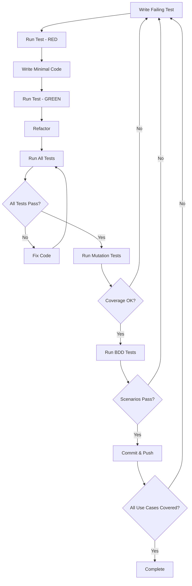

# Golang API Development Instructions

This directory contains comprehensive instructions and best practices for developing synchronous and asynchronous APIs in Go using Test-Driven Development (TDD) methodology.

## Table of Contents

1. [Project Structure](./01-project-structure.md) - Standard Go project layout
2. [HTTP Server Setup](./02-http-server-setup.md) - Setting up HTTP servers
3. [Synchronous APIs](./03-synchronous-apis.md) - Building sync REST APIs
4. [Asynchronous APIs](./04-asynchronous-apis.md) - Async patterns and implementations
5. [Error Handling](./05-error-handling.md) - Error management best practices
6. [Middleware & Authentication](./06-middleware-auth.md) - Security and middleware patterns
7. [Database Operations](./07-database-operations.md) - Database integration patterns
8. [Testing Strategies](./08-testing-strategies.md) - Unit, integration, and E2E testing
9. [Performance Optimization](./09-performance-optimization.md) - Performance best practices
10. [Deployment & DevOps](./10-deployment-devops.md) - Production deployment guidelines
11. [TDD Workflow](./11-tdd-workflow.md) - **Test-Driven Development workflow and practices**
12. [TDD Practices](./12-tdd-practices.md) - **TDD principles and implementation**
13. [Advanced Testing](./13-advanced-testing.md) - **Mutation testing and BDD with Cucumber**

## Quick Start with TDD

For a new Go API project using TDD:
1. Follow the [project structure](./01-project-structure.md) guidelines
2. Set up your development environment with testing tools
3. Follow the [TDD workflow](./11-tdd-workflow.md) for each feature
4. Write tests first following [TDD practices](./12-tdd-practices.md)
5. Implement features to pass tests
6. Run [advanced testing](./13-advanced-testing.md) including mutation and BDD tests
7. Refactor with confidence

## Key Principles

- **Test-First Development**: Write tests before implementation
- **Red-Green-Refactor**: Follow the TDD cycle rigorously
- **100% Use Case Coverage**: Ensure all business logic is tested
- **Continuous Integration**: Automate testing in your pipeline
- **Simplicity**: Keep code simple and readable
- **Explicit over implicit**: Be clear about what your code does
- **Error handling**: Always handle errors appropriately
- **Testing**: Write tests for all critical paths
- **Performance**: Profile before optimizing

## Development Workflow Overview

